## 1.1 Entorno 1 — JupyterLab + Almond Kernel + Scala 2.12.21

Ahora debemos descargar Python, para ello accedemos a esta página [python.org/downloads/release/python-3129](https://www.python.org/downloads/release/python-3129/) y nos descargamos la versión 3.12 que es la que se recomienda

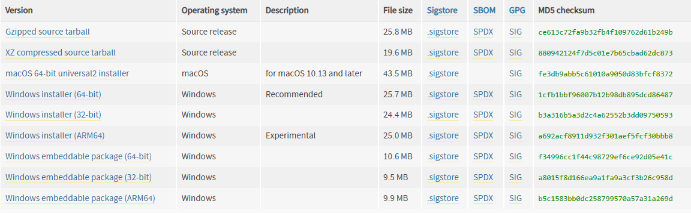

Una vez descargado procedemos a su instalación marcando la casilla 'ADD TO PATH'.

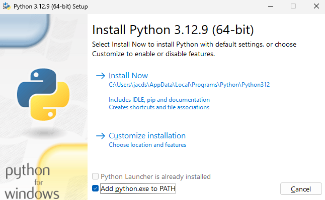

Abrimos un cmd y ejecutamos 'python --version' para comprobar que lo tenemos instalado

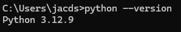

Teniendo miniconda o anaconda y python instalado y funcionando pasamos a la instalación de JupyterLab.
Abrimos un cmd y escribimos 'pip install jupyterlab'

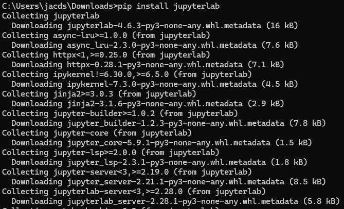

Pasamos a descargarnos Java SDK 17, accedemos a esta página y bajamos hasta Windows [oracle.com/java/technologies/javase/jdk17-archive-downloads](https://www.oracle.com/java/technologies/javase/jdk17-archive-downloads.html)

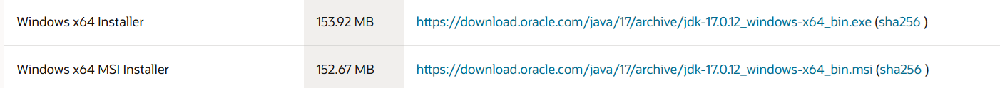

Durante el asistente de instalación debemos marcar la casilla de ADD TO JAVA_HOME, en caso de que no salga como es mi caso, debemos abrir la aplicación 'EDITAR VARIABLES DE ENTORNO' de windows y agregar la nueva variable como se puede observar en la imagen

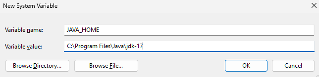

Ahora en un nuevo cmd comprobamos la versión

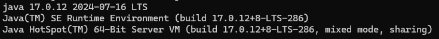

Ahora instalaremos el kernel de Almond y Scala 2.12.21. Para ello debemos descargarnos coursier y coursier.bat desde este enlace [github.com/coursier/launchers](https://github.com/coursier/launchers) que nos permitirá instalar tanto el kernel como scala de la forma más sencilla

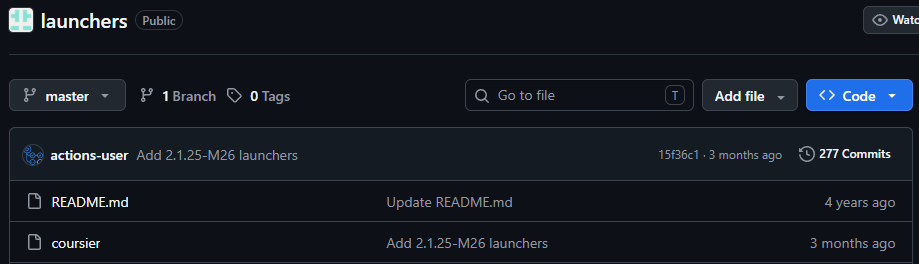

Debemos dirigirnos a la carpeta en la que lo hayamos descargado y ejecutar el comando `coursier.bat launch almond:0.14.5 --scala 2.12.21 -- --install`

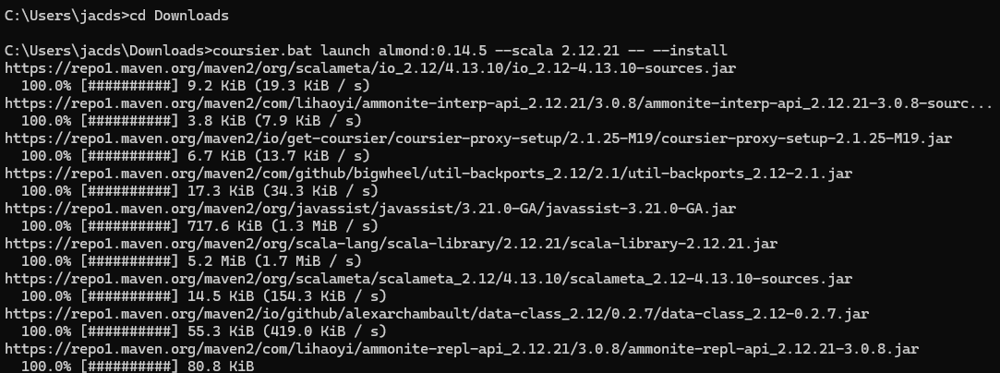

Nos dirigimos a la carpeta en la que queremos tener nuestro workspace y ejecutamos el comando 'jupyter lab'

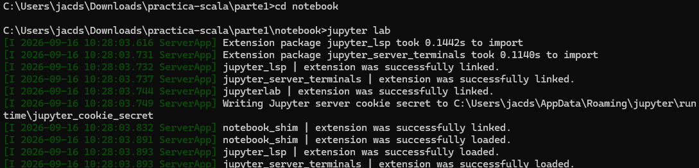

Abrimos jupyterlab en el navegador usando la URL proporcionada por el propio comando y debemos ver la opción de Scala

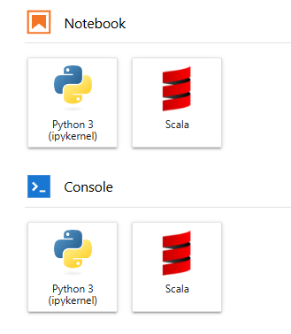

Para comprobar que funciona vamos a pulsar sobre el icono de Scala (dentro del apartado de notebook) y guardaremos el notebook de Scala en nuestro workspace


**Prueba 01:** Verificar versión exacta de Scala

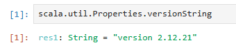

**Prueba 02:** Ejecutar el código de prueba

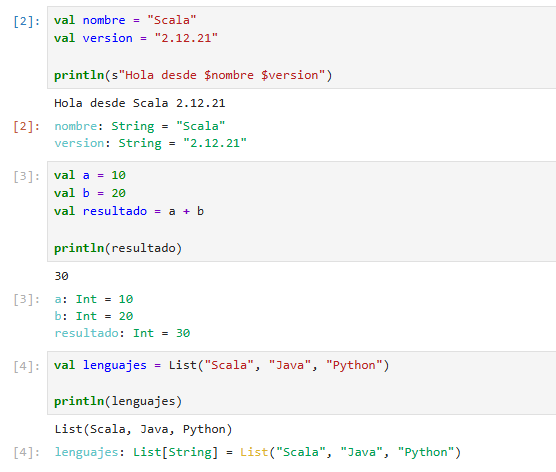

## 1.2 Entorno 2 — Visual Studio Code + Metals + Scala 2.12.21 + JDK 17 + sbt

Instalamos Java SDK 17 (este paso es el mismo que los anteriores).
Pasamos a descargarnos Java SDK 17, accedemos a esta página y bajamos hasta Windows [oracle.com/java/technologies/javase/jdk17-archive-downloads](https://www.oracle.com/java/technologies/javase/jdk17-archive-downloads.html)


Durante el asistente de instalación debemos marcar la casilla de ADD TO JAVA_HOME, en caso de que no salga como es mi caso, debemos abrir la aplicación 'EDITAR VARIABLES DE ENTORNO' de windows y agregar la nueva variable como se puede observar en la imagen


Ahora en un nuevo cmd comprobamos la versión


Instalamos Visual Studio Code desde [code.visualstudio.com](https://code.visualstudio.com/) y simplemente seguimos el asistente de instalación


Una vez dentro de VSCode nos vamos a extensiones (ctrl+shift+x) y buscamos Scala (Metals)


Pasamos a instalar sbt, para esto nos dirigimos a su GitHub [github.com/sbt/sbt/releases](https://github.com/sbt/sbt/releases) y descargamos la última versión

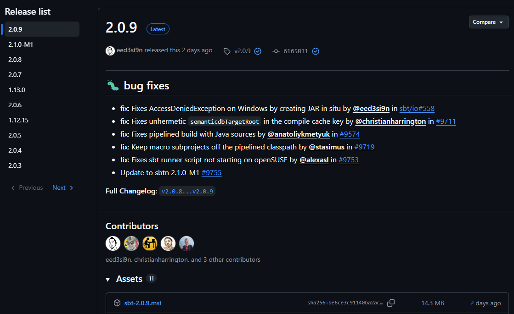

Seguimos el asistente de instalación y en cuestión de segundos ya lo tendremos instalado

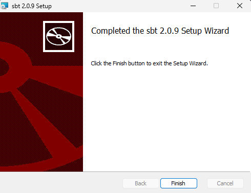

Para comprobar si se ha instalado correctamente, abrimos un cmd y ejecutamos `sbt --version`

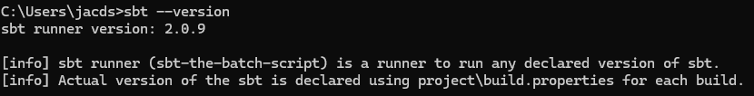

Con todo lo necesario, abrimos la carpeta que vamos a usar como workspace con VSCode y creamos la estructura del proyecto

```
scala-vscode/
├── build.sbt
├── project/
└── src/
    └── main/
        └── scala/
            └── Main.scala
```


Dentro del fichero build.sbt debemos indicar el nombre del proyecto, la versión del proyecto y la versión de scala

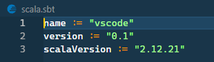

Dentro del fichero Main.scala creamos un pequeño programa

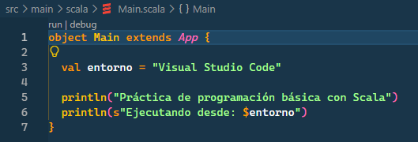

Al tener la extensión de Scala (Metals) se nos crean varios directorios nuevos que permanecen ocultos por defecto

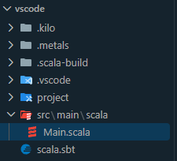

Para comprobar si nuestro proyecto funciona, en VSCode abrimos una nueva terminal (ctrl+ñ) y ejecutamos `sbt compile`

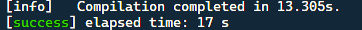

Es probable que no se pueda usar `sbt compile` y te pida usar antes `sbt new` o `sbt --allow-empty`. En este caso, puedes usar `sbt --allow-empty` y luego `sbt compile` ya que usando `sbt new` te obligará a seleccionar un template para poder continuar.

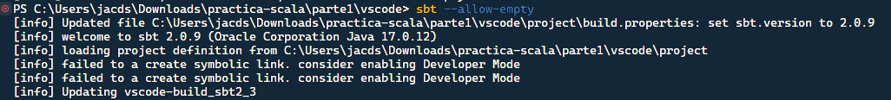

Después de compilar ejecutamos `sbt run` para lanzar el programa

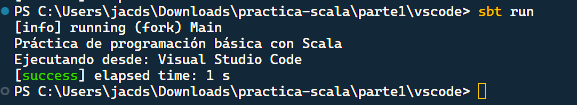

## 1.3 Entorno 3 — IntelliJ IDEA Community + Scala 2.12.21 + sbt

Nos dirigimos a [jetbrains.com/es-es/idea/download](https://www.jetbrains.com/es-es/idea/download/?section=windows) y pulsamos el botón de Descargar

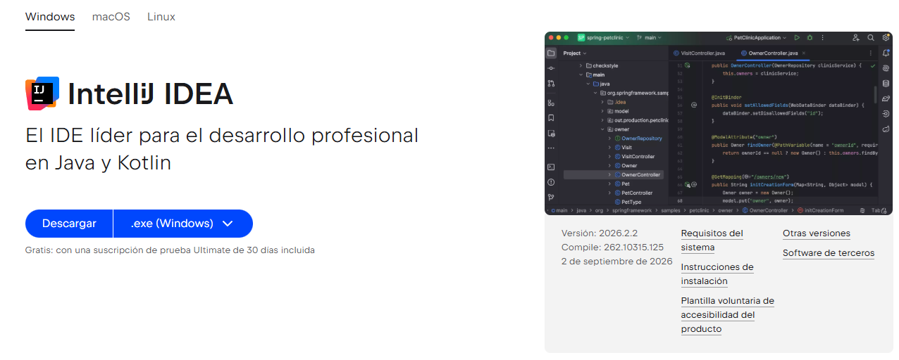

Seguimos el asistente de instalación. Podemos marcar el checkbox 'ADD TO PATH' si queremos poder lanzar la aplicación desde la terminal. Como no es mi caso, no la marco.

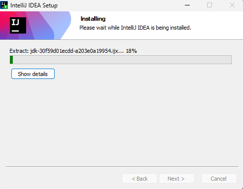

Una vez instalado, lo abrimos y nos dirigimos a los plugins para instalar el plugin oficial de Scala

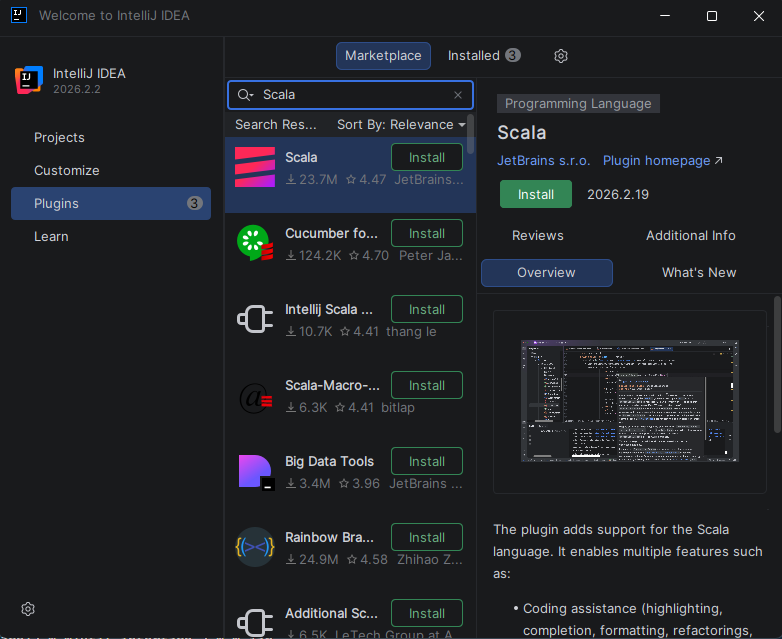

Con el plugin instalado, vamos a la pantalla principal y pulsamos en Nuevo Proyecto. Debemos seleccionar Scala en el panel de la izquierda y elegir las versiones de sbt y Scala que ya hemos instalado en los pasos anteriores (en caso de no haber hecho los pasos anteriores podemos marcar la casilla de Download para que se descarguen automáticamente)

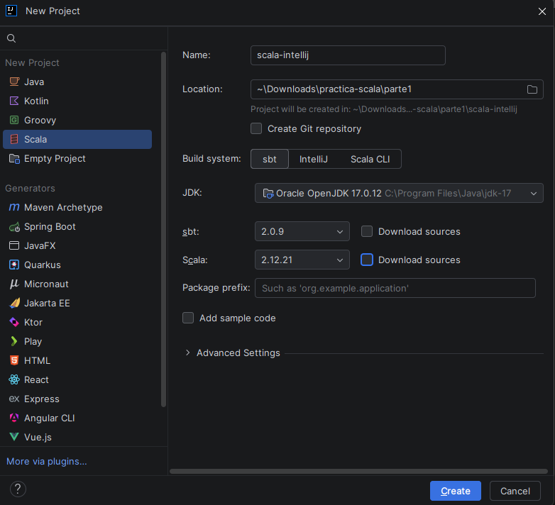

Comprobamos que la estructura de los ficheros es la correcta

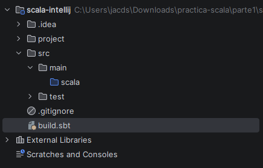

Comprobamos el contenido del fichero build.sbt y verificamos la versión de scala

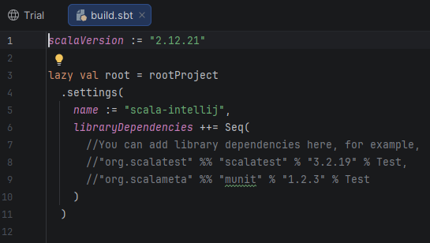

Nos dirigimos hasta la carpeta src > main > scala y hacemos click derecho y pulsamos en New > Scala Class/File, seleccionamos Object y de nombre ponemos Main.

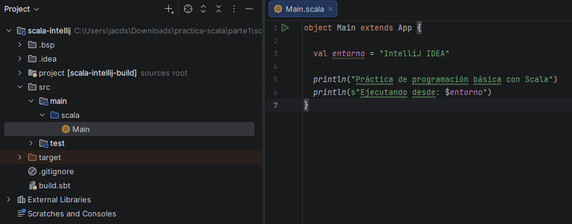

Para compilar y ejecutar pulsamos el botón verde superior y se nos abrirá en la parte inferior una terminal donde podremos ver el output de la ejecución.

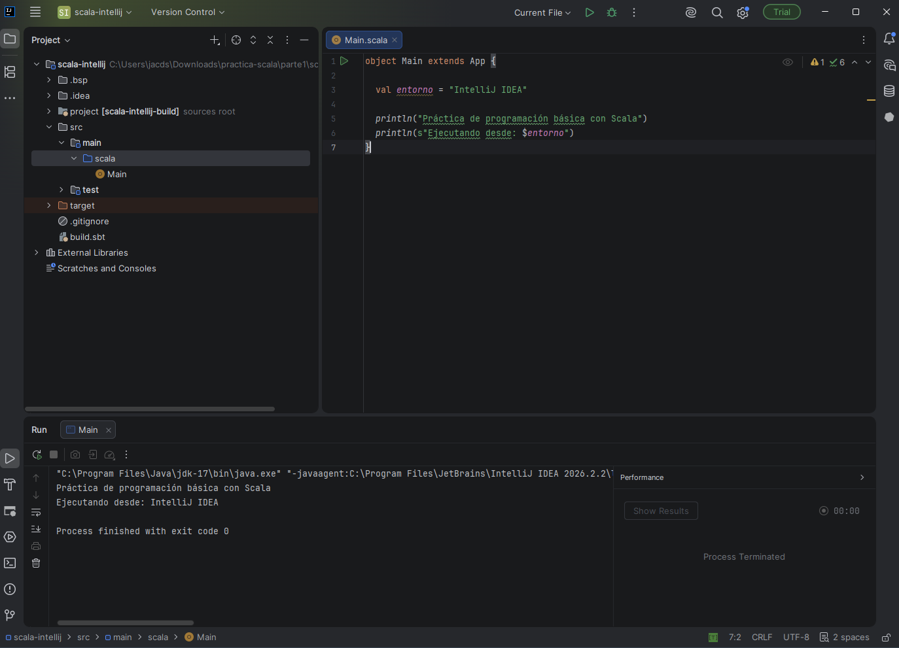