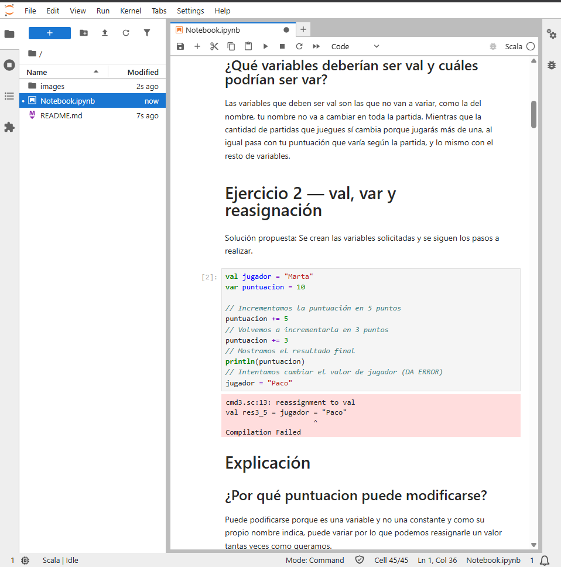
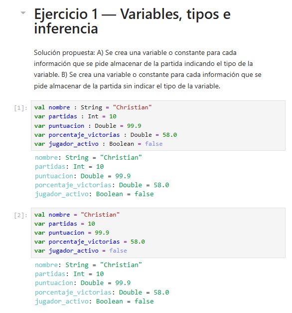
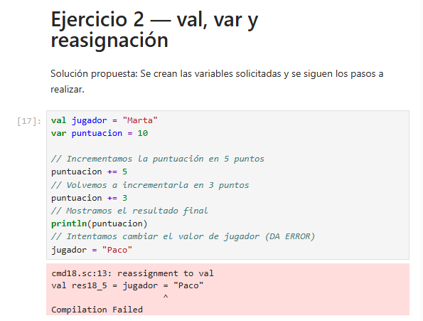
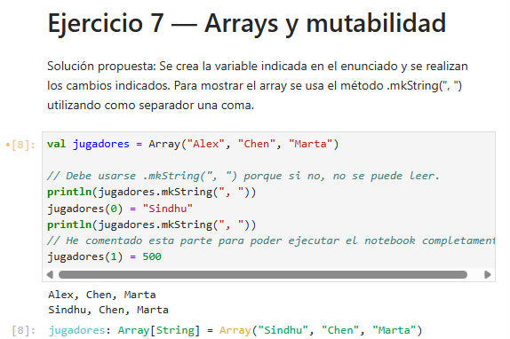
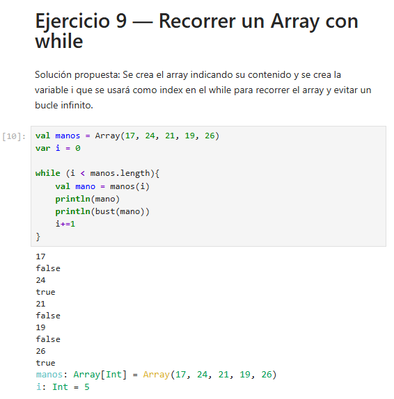
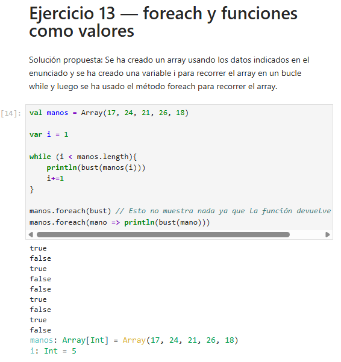
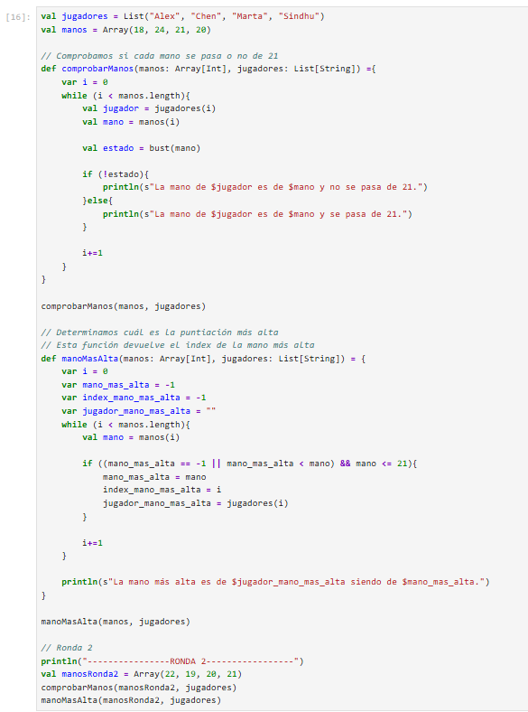

# Parte 2 — Programación con Scala en JupyterLab

## Entorno Utilizado
- **IDE:** JupyterLab
- **Kernel:** Almond Kernel
- **Lenguaje:** Scala 2.12.21

## Contenido
Esta carpeta contiene la resolución de los **15 ejercicios de programación** en Scala basados en los capítulos 1, 2 y 3 del curso. Se abordan conceptos de mutabilidad, tipos de datos, colecciones (`Array`, `List`), estructuras de control y estilos imperativo y funcional.

## Notebook del Proyecto
- [Ver Notebook Principal (notebook.ipynb)](notebook.ipynb)

---

## Comprobantes del Entorno

### 1. Entorno de Trabajo en JupyterLab

### 2. Confirmación de Kernel Almond y Versión de Scala

---

## Documentación y Evidencias de Ejercicios

### Ejercicio 1: Inferencia de Tipos y Declaración

### Ejercicio 2: Reasignación en Variables `val` (Captura de Error)

### Ejercicio 7: Mutabilidad de Arrays y Error de Tipado

### Ejercicio 9: Recorrido Imperativo con Bucle `while`

### Ejercicio 13: Comparativa `while` vs `foreach`

### Ejercicio 15: Programa Integrado — Torneo Twenty-One
