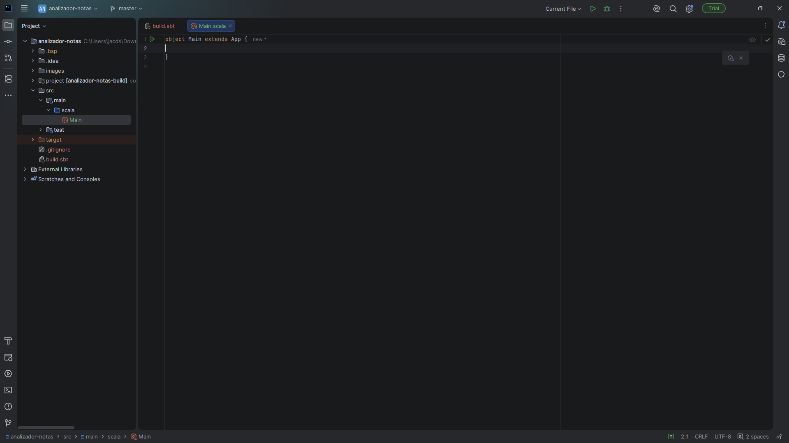
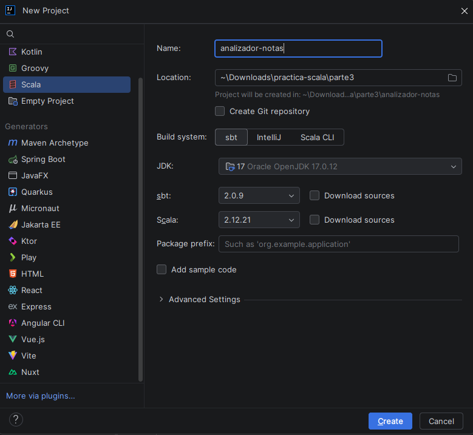
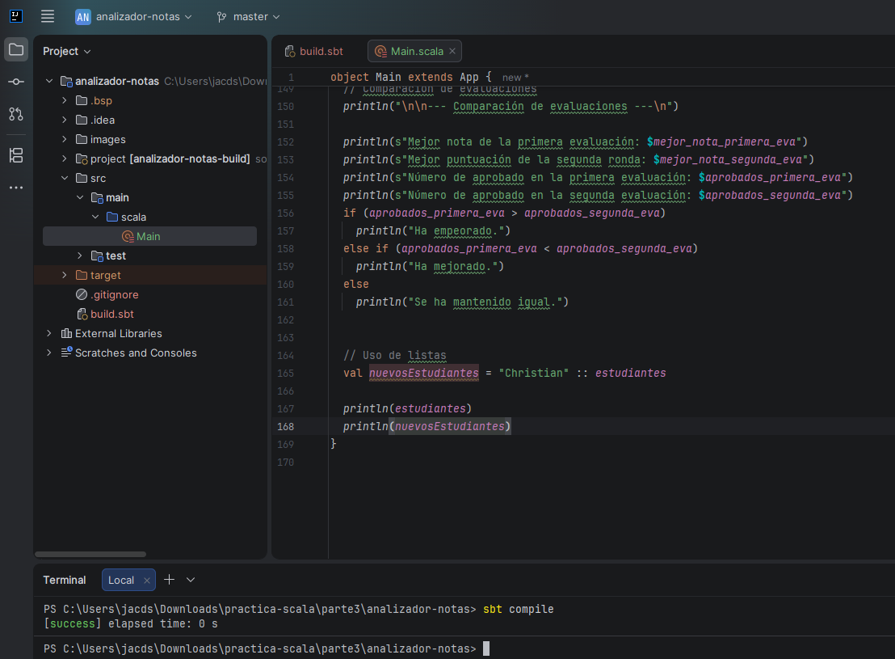
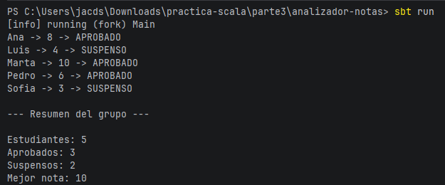
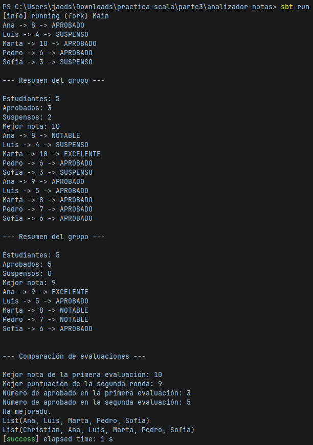

# Mini proyecto 3.2 — Analizador de notas

## Entorno de trabajo

El proyecto ha sido desarrollado utilizando las siguientes herramientas:

- **Editor:** IntelliJ IDEA
- **Extensión de Scala:** Scala Plugin para IntelliJ
- **Lenguaje:** Scala 2.12.21
- **Kit de desarrollo:** JDK 17
- **Gestor de construcción:** sbt (Scala Build Tool)

### Capturas del entorno

| Requisito | Captura |
| :--- | :--- |
| IntelliJ IDEA abierto |  |
| Plugin de Scala, JDK 17 y sbt activos |  |

---

## Descripción

Este proyecto consiste en un analizador de calificaciones académicas de estudiantes. El programa procesa las notas obtenidas en dos evaluaciones, determinando:

1. El estado académico individual de cada estudiante (`APROBADO` o `SUSPENSO`).
2. La clasificación según la nota (`EXCELENTE`, `NOTABLE`, `APROBADO` o `SUSPENSO`).
3. El cálculo de estadísticas globales por evaluación (aprobados, suspensos y nota máxima).
4. La comparación del rendimiento entre evaluaciones según la variación en el número de aprobados.

---

## Estructura del proyecto

El proyecto sigue la estructura estándar organizada con `sbt`:

```text
analizador-notas/
├── build.sbt
├── project/
│   └── build.properties
└── src/
    └── main/
        └── scala/
            └── Main.scala
```

- **`build.sbt`**: Archivo de configuración donde se especifican el nombre del proyecto (analizador-notas) y la versión de Scala (2.12.21).
- **`src/main/scala/Main.scala`**: Código fuente principal que contiene la lógica del juego y las funciones auxiliares.

---

## Funciones utilizadas

- **`aprobado(nota: Int): Boolean`**: Devuelve true si la nota es mayor o igual a 5, y false en caso contrario.
- **`estadoNota(nota: Int): String`**: Utiliza la función aprobado para devolver "APROBADO" o "SUSPENSO".
- **`maxNota(a: Int, b: Int): Int`**: Compara dos notas numéricas y devuelve la mayor utilizando if y else.
- **`clasificacion(nota: Int): String`**: Clasifica la nota cualitativamente usando `if`, `else if` y `else`:
  - `9` o `10` $\rightarrow$ `"EXCELENTE"`
  - `7` u `8` $\rightarrow$ `"NOTABLE"`
  - `5` o `6` $\rightarrow$ `"APROBADO"`
  - `0` a `4` $\rightarrow$ `"SUSPENSO"`
- **`contarNotas(notas: Array[Int], buscar: String): Int`**: Recorre el arreglo de notas con un bucle `while` y cuenta cuántas coinciden con el estado especificado (`"APROBADO"` o `"SUSPENSO"`).
- **`mejorNota(puntuaciones: Array[Int]): Int`**: Determina la nota más alta del grupo iterando sobre el arreglo con la función `maxNota`.

---

## Colecciones utilizadas

Para el almacenamiento y la gestión de datos dentro del programa se han empleado las siguientes estructuras:

- **`List[String]` (`estudiantes`)**: 
  - **Uso:** Almacena los nombres de los estudiantes (`"Ana"`, `"Luis"`, `"Marta"`, `"Pedro"`, `"Sofia"`).

- **`Array[Int]` (`notas` y `notasSegundaEvaluacion`)**:
  - **Uso:** Almacena las notas individuales de cada alumno en una evaluación.

---

## Inmutabilidad y operador `::`

En la parte final del programa se añade un nuevo alumno a la lista inicial:

```scala
val nuevosEstudiantes = "Christian" :: estudiantes
```

---

## Compilación y ejecución

El programa se compila y ejecuta desde la terminal integrada de VS Code utilizando la herramienta `sbt`.

### Comandos utilizados

```bash
# Compilación del proyecto
sbt compile

# Ejecución de la aplicación
sbt run
```

### Evidencias de ejecución

| Paso | Captura |
| :--- | :--- |
| Compilación exitosa (`sbt compile`) |  |
| Ejecución del programa (`sbt run`) |  |
| Salida Entera |  |

---

## Resultados obtenidos

Al ejecutar la aplicación con los datos del enunciado, se obtienen los siguientes resultados:

* **Primera evaluación:**
  * **Estudiantes:** 5
  * **Aprobados:** 3 (Ana: 8, Marta: 10, Pedro: 6)
  * **Suspensos:** 2 (Luis: 4, Sofia: 3)
  * **Mejor nota:** 10 (Marta)

* **Segunda evaluación:**
  * **Estudiantes:** 5
  * **Aprobados:** 5 (Ana: 9, Luis: 5, Marta: 8, Pedro: 7, Sofia: 6)
  * **Suspensos:** 0
  * **Mejor nota:** 9 (Ana)

* **Comparación de evaluaciones:** 
  * Aprobados Primera Evaluación: 3 | Aprobados Segunda Evaluación: 5
  * **Conclusión:** El grupo **ha mejorado** (el número de aprobados aumentó de 3 a 5).

* **Demostración de inmutabilidad:**
  * `estudiantes`: `List(Ana, Luis, Marta, Pedro, Sofia)`
  * `nuevosEstudiantes`: `List(Christian, Ana, Luis, Marta, Pedro, Sofia)`