# Mini proyecto 3.1 — Torneo de Twenty-One

## Entorno de trabajo

El proyecto ha sido desarrollado utilizando las siguientes herramientas:

- **Editor:** Visual Studio Code
- **Extensión de Scala:** Metals
- **Lenguaje:** Scala 2.12.21
- **Kit de desarrollo:** JDK 17
- **Gestor de construcción:** sbt (Scala Build Tool)

### Capturas del entorno

| Requisito | Captura |
| :--- | :--- |
| Visual Studio Code abierto | 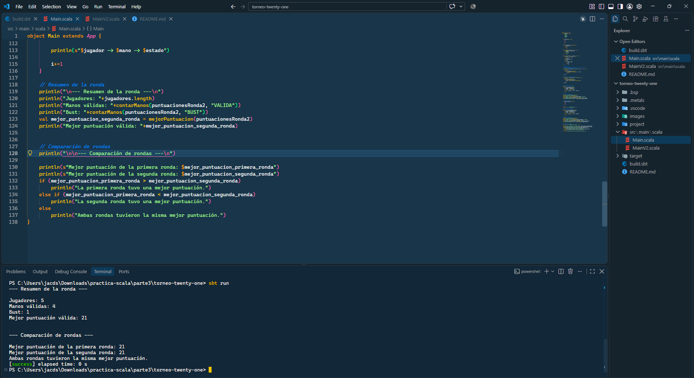 |
| Extensión Metals activa | 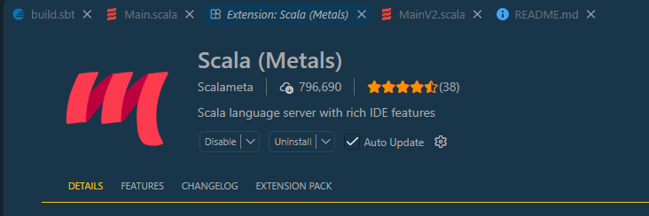 |
| Versión de Java JDK 17 | 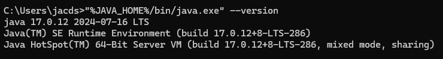 |
| Proyecto sbt abierto | 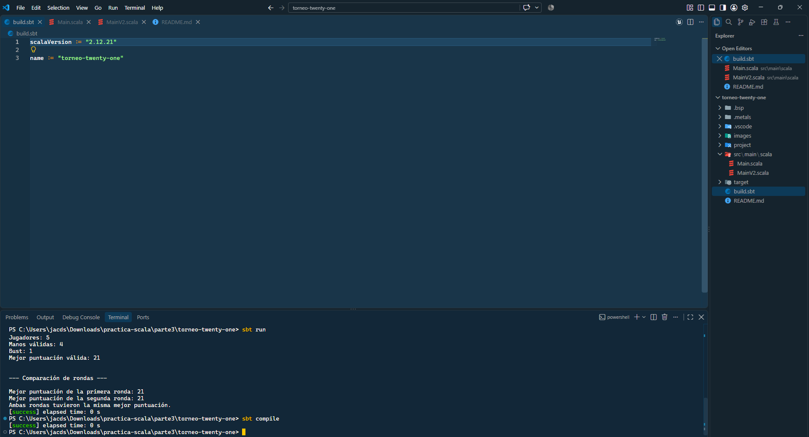 |
| Configuración de Scala 2.12.21 (`build.sbt`) | 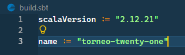 |
| Metals reconociendo el proyecto | 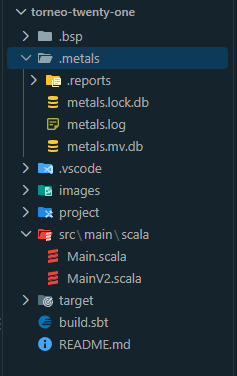 |

---

## Descripción

Este proyecto consiste en un analizador de resultados para un torneo del juego **Twenty-One** (similar al Blackjack). El programa procesa las puntuaciones de un conjunto de jugadores a lo largo de dos rondas consecutivas, evaluando:

1. Si la puntuación de cada jugador es válida o si se ha pasado de 21 (`BUST`).
2. El recuento total de manos válidas y eliminadas por ronda.
3. La mejor puntuación válida obtenida en cada ronda.
4. La comparación final entre ambas rondas para determinar cuál tuvo un desempeño superior.

---

## Estructura del proyecto

La aplicación sigue la organización estándar recomendada para proyectos Scala gestionados con `sbt`:

```text
torneo-twenty-one/
├── build.sbt
├── project/
│   └── build.properties
└── src/
    └── main/
        └── scala/
            └── Main.scala
```

- **`build.sbt`**: Archivo de configuración donde se especifican el nombre del proyecto (`torneo-twenty-one`) y la versión de Scala (`2.12.21`).
- **`src/main/scala/Main.scala`**: Código fuente principal que contiene la lógica del juego, las funciones auxiliares y el flujo de ejecución.
- **`src/main/scala/MainV2.scala`**: Exactamente igual que Main.scala solo que cambia el while de la función contarManos() por un foreach.

---

## Funciones utilizadas

- **`bust(puntuacion: Int): Boolean`**: Evalúa si una puntuación supera el límite de 21. Devuelve `true` si la mano está fuera de juego y `false` en caso contrario.
- **`estadoMano(puntuacion: Int): String`**: Utiliza `bust` para clasificar la mano devolviendo `"VALIDA"` o `"BUST"`.
- **`mejorMano(handA: Int, handB: Int): Int`**: Compara dos puntuaciones aplicando las reglas de Twenty-One: descarta cualquier mano que supere 21 (devolviendo `0` si ambas son nulas) y retoma la mano de mayor valor entre las válidas.
- **`contarManos(puntuaciones: Array[Int], buscar: String): Int`**: Recorre un arreglo de puntuaciones e identifica cuántas coinciden con el estado recibido (`"VALIDA"` o `"BUST"`).
- **`mejorPuntuacion(puntuaciones: Array[Int]): Int`**: Determina la puntuación válida más alta de una ronda iterando sobre el arreglo mediante la función `mejorMano`.

---

## Comparativa: `while` vs `foreach` (Sección 3.1.14)

En el desarrollo del proyecto se implementaron e investigaron dos enfoques para el recorrido e inspección de las colecciones:

| Criterio | Bucle `while` | Método `foreach` |
| :--- | :--- | :--- |
| **Control de índice** | Requiere un contador manual (`var i = 0`). | No requiere contador; abstrae el acceso a índices. |
| **Mutabilidad** | Requiere una variable mutable (`var`) para la condición de parada. | No requiere variables mutables externas. |
| **Estilo de programación** | Imperativo (indica *cómo* iterar paso a paso). | Funcional (indica *qué hacer* con cada elemento). |
| **Riesgo de errores** | Propenso a errores como `IndexOutOfBoundsException`. | Seguro contra errores de desbordamiento de límites. |

**Conclusión:** El uso de `foreach` se aproxima mucho más al paradigma **funcional** promovido en Scala, ya que trata las colecciones como estructuras declarativas y evita la manipulación directa de variables mutables de control.

---

## Compilación y ejecución

El programa se compila y ejecuta desde la terminal integrada de VS Code utilizando la herramienta `sbt`.

### Comandos utilizados

```bash
# Compilación del proyecto
sbt compile

# Ejecución de la aplicación
sbt run
```

### Evidencias de ejecución

| Paso | Captura |
| :--- | :--- |
| Compilación exitosa (`sbt compile`) | 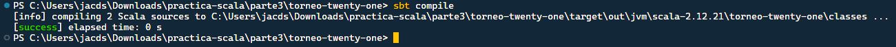 |
| Ejecución del programa (`sbt run`) | 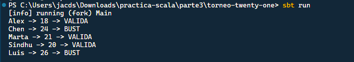 |
| Salida de la Primera Ronda | 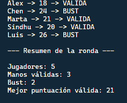 |
| Salida de la Segunda Ronda | 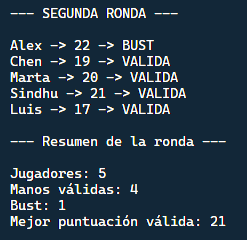 |
| Comparación Final entre Rondas | 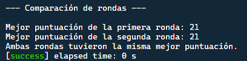 |

---

### Resultados obtenidos

Al ejecutar la aplicación con los datos proporcionados, se obtienen los siguientes resultados consolidados:

* **Primera ronda:**
  * **Jugadores:** 5
  * **Manos válidas:** 3 (Alex: 18, Marta: 21, Sindhu: 20)
  * **Bust:** 2 (Chen: 24, Luis: 26)
  * **Mejor puntuación válida:** 21

* **Segunda ronda:**
  * **Jugadores:** 5
  * **Manos válidas:** 4 (Chen: 19, Marta: 20, Sindhu: 21, Luis: 17)
  * **Bust:** 1 (Alex: 22)
  * **Mejor puntuación válida:** 21

* **Comparación final:** Ambas rondas registraron la misma mejor puntuación válida (**21**).